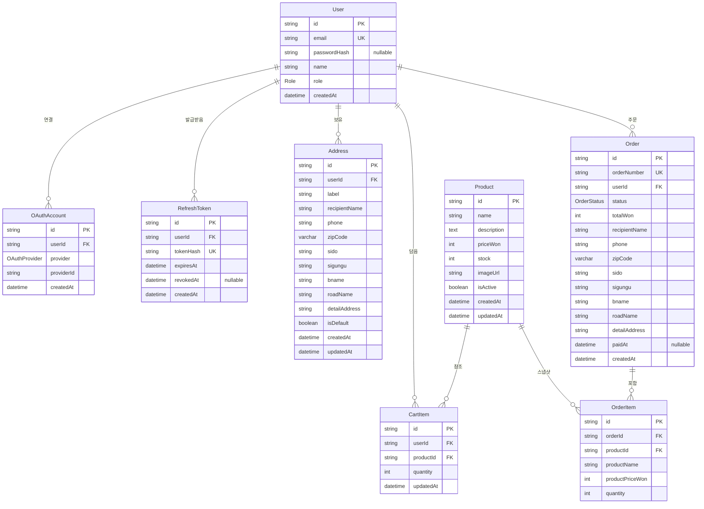

# 데이터 모델

> Prisma schema와 모델별 설계 결정.
> 각 슬라이스는 자기에게 해당하는 모델 H2 섹션만 참고하면 됨.

---

## 전체 ERD



---

## Prisma schema 헤더 (공통)

```prisma
generator client {
  provider = "prisma-client-js"
}

generator erd {
  provider = "prisma-erd-generator"
  output   = "../docs/erd.md"
}

datasource db {
  provider = "mysql"
  url      = env("DATABASE_URL")
}

enum Role {
  USER
  ADMIN
}

enum OAuthProvider {
  GOOGLE
  // 확장 시 KAKAO, NAVER 등
}

enum OrderStatus {
  PENDING
  PAID
  CANCELED
}
```

---

## User & OAuthAccount & RefreshToken

> Slice 1 (Auth) 에서 사용. 인증 디테일은 [auth-strategy.md](./auth-strategy.md) 참고.

### 설계 결정

| 결정 | 근거 |
|------|------|
| **User에서 provider 필드 제거, OAuthAccount 분리** | 한 사용자가 LOCAL + 여러 OAuth를 동시 보유 가능. 계정 연결(account linking) 지원 |
| **`passwordHash` nullable** | OAuth 전용 계정(LOCAL 비활성)을 표현 |
| **RefreshToken 별도 테이블** | JWT rotation + 재사용 감지 위해 DB에 hash 저장 필요 |
| **`tokenHash`만 저장** | 평문 refresh는 DB에 두지 않음 (sha256) |

### Prisma 모델

```prisma
model User {
  id           String   @id @default(cuid())
  email        String   @unique
  passwordHash String?  // null이면 LOCAL 로그인 비활성 (OAuth 전용)
  name         String
  role         Role     @default(USER)
  createdAt    DateTime @default(now())

  oauthAccounts OAuthAccount[]
  refreshTokens RefreshToken[]
  addresses     Address[]
  cartItems     CartItem[]
  orders        Order[]
}

model OAuthAccount {
  id         String        @id @default(cuid())
  userId     String
  user       User          @relation(fields: [userId], references: [id], onDelete: Cascade)
  provider   OAuthProvider
  providerId String        // Google sub 등
  createdAt  DateTime      @default(now())

  @@unique([provider, providerId])  // 같은 외부 계정이 두 User에 매핑 안 됨
  @@unique([userId, provider])      // 한 User당 한 provider 1개
}

model RefreshToken {
  id        String    @id @default(cuid())
  userId    String
  user      User      @relation(fields: [userId], references: [id], onDelete: Cascade)
  tokenHash String    @unique          // 평문 refresh의 sha256
  expiresAt DateTime
  revokedAt DateTime?                  // 사용/무효화 시점 (rotation에서 재사용 감지용)
  createdAt DateTime  @default(now())

  @@index([userId])
}
```

---

## Address

> Slice 4 (Address) 에서 사용. Slice 5 (Order) 의 배송지 스냅샷 출처.

### 설계 결정

| 결정 | 근거 |
|------|------|
| **다중 주소 + `isDefault` 플래그** | 실제 이커머스 UX. 한 유저가 여러 주소를 등록 가능, 기본 주소는 1개 |
| **완전 정규화** (sido/sigungu/bname/roadName) | 지역별 통계 쿼리 가능, 카카오 API 응답과 매핑 |
| **`label` 사용자 정의** | "집", "회사", "본가" 등 식별 |

### Prisma 모델

```prisma
model Address {
  id            String   @id @default(cuid())
  userId        String
  user          User     @relation(fields: [userId], references: [id], onDelete: Cascade)

  label         String   // "집", "회사" 등

  recipientName String
  phone         String

  zipCode       String   @db.VarChar(5)
  sido          String   // "서울특별시"
  sigungu       String   // "강남구"
  bname         String   // "역삼동" (법정동)
  roadName      String   // "테헤란로 123" (도로명 + 번지, 시구 제외)
  detailAddress String   // 사용자 직접 입력

  isDefault     Boolean  @default(false)
  createdAt     DateTime @default(now())
  updatedAt     DateTime @updatedAt

  @@index([userId])
}
```

### 카카오 우편번호 API 매핑

```ts
// 카카오 API 응답
{
  zonecode: "06234",
  sido: "서울",
  sigungu: "강남구",
  bname: "역삼동",
  roadAddress: "서울 강남구 테헤란로 123",
  // ...
}

// → Address 저장
{
  zipCode: data.zonecode,
  sido: data.sido,
  sigungu: data.sigungu,
  bname: data.bname,
  roadName: extractRoadName(   // "테헤란로 123" (시/구 제외)
    data.roadAddress,
    data.sido,
    data.sigungu,
  ),
  detailAddress: userInput,
}
```

`extractRoadName`은 `shared/util/address.ts`에 분리.

---

## Product

> Slice 2 (Catalog), Slice 6 (Admin) 에서 사용. CartItem/OrderItem의 참조 대상.

### 설계 결정

| 결정 | 근거 |
|------|------|
| **가격은 `Int` (원 단위)** | 부동소수 오류 회피, 한국 원화는 소수점 없음 |
| **Soft delete 미적용** | `isActive` 플래그로 진열만 제어 |
| **카테고리 분리 안 함** | MVP 핵심 거래 플로우에 불필요 |

### Prisma 모델

```prisma
model Product {
  id          String   @id @default(cuid())
  name        String
  description String   @db.Text
  priceWon    Int      // 원 단위 정수
  stock       Int      @default(0)
  imageUrl    String   // /uploads/xxx.jpg 또는 외부 URL
  isActive    Boolean  @default(true)
  createdAt   DateTime @default(now())
  updatedAt   DateTime @updatedAt

  cartItems  CartItem[]
  orderItems OrderItem[]
}
```

---

## CartItem (Cart 테이블 없는 Aggregate 패턴)

> Slice 3 (Cart) 에서 사용. Clean Architecture + DDD 적용.
> 아키텍처 패턴은 [api-architecture.md](./api-architecture.md), DDD 규칙은 [../architecture/ddd-rules.md](../architecture/ddd-rules.md) 참고.

### 설계 결정

| 결정 | 근거 |
|------|------|
| **Cart 테이블 없음** | DDD 원칙: Aggregate ≠ Table 1:1. Cart 자체에 의미 있는 상태 없음. CartRepository가 cart_items 행들을 모아 Cart Aggregate 재구성 |
| **`CartItem.userId` 직접 보유** | Cart 테이블 제거 결과. `@@unique([userId, productId])`로 중복 방지 |

### Prisma 모델

```prisma
// 주의: Cart 테이블 없음. Cart 도메인 클래스는 코드에만 존재
model CartItem {
  id        String   @id @default(cuid())
  userId    String
  user      User     @relation(fields: [userId], references: [id], onDelete: Cascade)
  productId String
  product   Product  @relation(fields: [productId], references: [id])
  quantity  Int
  updatedAt DateTime @updatedAt

  @@unique([userId, productId])  // 같은 상품 중복 담기 금지
  @@index([userId])
}
```

### Cart 도메인 코드 미리보기

```ts
// src/modules/cart/domain/cart.aggregate.ts
// @nestjs/cqrs import 없음 — 순수 도메인 (shared/domain 자체 베이스 상속)
import { AggregateRoot } from '../../../shared/domain/aggregate-root';

export class Cart extends AggregateRoot {
  private constructor(
    public readonly userId: string,
    private _items: CartItem[],
  ) { super(); }

  static reconstitute(userId: string, items: CartItem[]): Cart {
    return new Cart(userId, items);
  }

  static empty(userId: string): Cart {
    return new Cart(userId, []);
  }

  addItem(productId: string, quantity: number): void {
    // 불변식 검증 + 상태 변경 후 addEvent() — 전체 패턴은 api-architecture.md §4
  }

  // ... removeItem, changeQuantity, clear, getTotalWon
}
```

### CartRepository 구현 패턴

```ts
// src/modules/cart/infrastructure/persistence/cart.prisma.repository.ts
export class CartPrismaRepository implements CartRepository {
  async findByUserId(userId: string): Promise<Cart> {
    const rows = await this.prisma.cartItem.findMany({ where: { userId } });
    return CartMapper.toDomain(userId, rows);
  }

  async save(cart: Cart): Promise<void> {
    await this.prisma.$transaction(async (tx) => {
      await tx.cartItem.deleteMany({ where: { userId: cart.userId } });
      const rows = CartMapper.toPersistence(cart);
      if (rows.length > 0) await tx.cartItem.createMany({ data: rows });
    });
  }
}
```

MVP는 "전체 교체" 전략. 성능 최적화(delta 계산)는 필요해질 때 도입.

---

## Order & OrderItem

> Slice 5 (Order) 에서 사용. Clean Architecture + DDD 적용.

### 설계 결정

| 결정 | 근거 |
|------|------|
| **OrderItem에 상품 스냅샷** | 상품 가격/이름이 변경되어도 과거 주문은 그대로 유지 |
| **Order에 배송지 스냅샷 (FK 없음)** | 사용자가 Address를 수정/삭제해도 과거 주문은 영구 보존 |
| **`orderNumber` 별도 필드** | URL/화면에 cuid 직접 노출 안 함. "ORD-YYYYMMDD-XXXX" 형식 |
| **`totalWon` 스냅샷** | 주문 시점의 총액 보존 |
| **상태 enum** | PENDING → PAID 또는 CANCELED |

### Prisma 모델

```prisma
model Order {
  id          String      @id @default(cuid())
  orderNumber String      @unique  // "ORD-YYYYMMDD-XXXX"
  userId      String
  user        User        @relation(fields: [userId], references: [id])
  status      OrderStatus @default(PENDING)
  totalWon    Int

  // 배송지 스냅샷 (주문 시점 Address에서 복사, FK 없음)
  recipientName String
  phone         String
  zipCode       String   @db.VarChar(5)
  sido          String
  sigungu       String
  bname         String
  roadName      String
  detailAddress String

  items     OrderItem[]
  paidAt    DateTime?
  createdAt DateTime    @default(now())

  @@index([userId, createdAt])  // "내 주문 내역" 최신순
}

model OrderItem {
  id              String  @id @default(cuid())
  orderId         String
  order           Order   @relation(fields: [orderId], references: [id], onDelete: Cascade)
  productId       String
  product         Product @relation(fields: [productId], references: [id])

  // 상품 스냅샷 (주문 시점 Product에서 복사)
  productName     String
  productPriceWon Int
  quantity        Int
}
```

### 상태 전이

- `PENDING` → `PAID` (결제 시뮬레이션 성공)
- `PENDING` → `CANCELED` (사용자 취소)
- `PAID` → (terminal, MVP에선 환불 없음)
