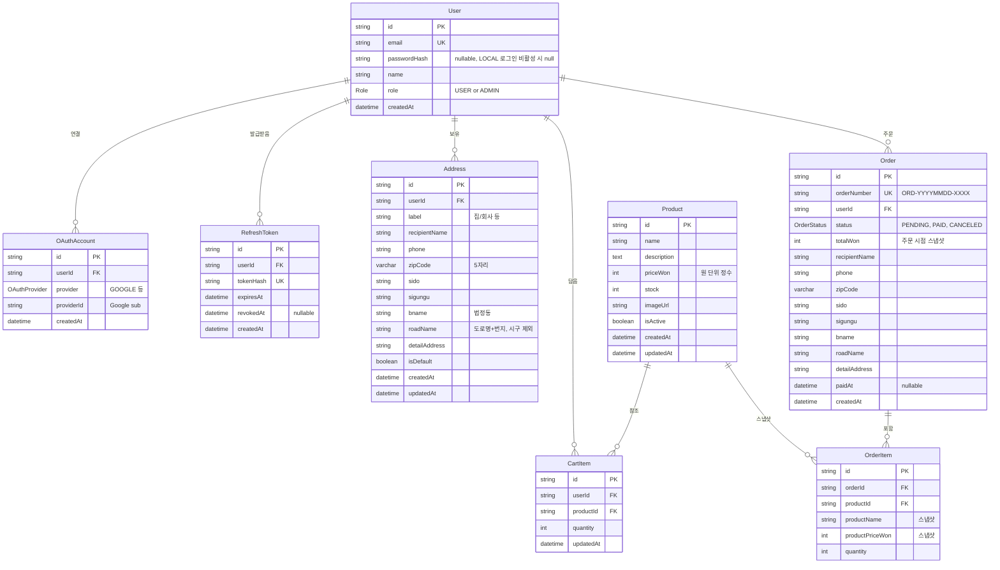

# goods-mall 설계 문서

> 애니메이션 캐릭터 굿즈 쇼핑몰 (포트폴리오/학습용)
> 작성: 2026-05-27
> 상태: **작성 중** — 진행하면서 섹션 추가

---

## 작성 진척

- [x] §1 전체 스택과 폴더 구조
- [x] §2 데이터베이스 스키마
- [x] §3 인증 전략
- [ ] §4 API 아키텍처 (Clean Architecture 상세)
- [ ] §5 프런트엔드 구조
- [ ] §6 에러 처리 및 검증
- [ ] §7 테스트 전략
- [ ] §8 슬라이스별 상세 범위

관련 문서:
- [DDD 적용 규칙](../../architecture/ddd-rules.md) — 모든 슬라이스에 적용

---

## 0. 결정사항 요약 (브레인스토밍 결과)

| 항목 | 결정 |
|------|------|
| **목적** | MVP 단기 완성 (포트폴리오/학습) |
| **MVP 범위** | 핵심 거래 플로우만 (회원가입 → 상품 → 장바구니 → 주문/결제 시뮬레이션 → 주문내역) |
| **인증** | 이메일+비밀번호 + Google OAuth |
| **배포** | 로컬만 완성 (`docker compose up` 수준) |
| **상품 데이터** | 시드 + 간단 관리자 UI (이미지 업로드 포함) |
| **UI 스타일링** | Tailwind + shadcn/ui |
| **테스트 범위** | 핵심 도메인 로직 단위 테스트만 |
| **저장소 구조** | 단일 레포, 계층 폴더(`api/`, `web/`)로 분리 |
| **API 아키텍처** | 핵심 도메인(`order`, `cart`)에만 Clean Architecture, 나머지는 단순 계층 |
| **진행 방식** | Vertical Slice — 슬라이스별로 풀스택 단위 작업 |

### 슬라이스 계획 (7개)

0. **Bootstrap** — Docker Compose(MariaDB) + NestJS skeleton + Next.js skeleton + Prisma 연결 + `/health`
1. **Auth** — 이메일+패스워드 회원가입/로그인 + Google OAuth + 인증 미들웨어
2. **Catalog** — 상품 목록 페이지 + 상세 페이지 + Prisma seed
3. **Cart** — 장바구니 추가/삭제/수량변경 + 장바구니 페이지 (DDD 적용)
4. **Address** — 마이페이지 주소 관리 (다중 주소 + 기본 주소)
5. **Order** — 주문 생성(결제 시뮬레이션) + 주문내역 (DDD 적용)
6. **Admin** — 관리자 상품 CRUD + 이미지 업로드

---

## §1 전체 스택과 폴더 구조

### 기술 스택

| 영역 | 선택 |
|------|------|
| API 서버 | NestJS (TypeScript) |
| Web | Next.js (App Router, TypeScript) |
| DB | MariaDB |
| ORM | Prisma (`mysql` provider, MariaDB 호환) |
| 인증 | 이메일+패스워드(bcrypt) + Google OAuth |
| 토큰 저장 | HttpOnly Secure Cookie (세션 또는 JWT — §3에서 결정) |
| API 통신 | REST + JSON |
| UI 라이브러리 | Tailwind CSS + shadcn/ui |
| 테스트 | Jest (단위 테스트, 핵심 도메인) |
| 우편번호 | 카카오 우편번호 API (무료, 키 불필요) |
| 로컬 환경 | Docker Compose (MariaDB), 호스트에서 api/web 실행 |

### 폴더 구조

```
goods-mall/
├── api/                        ← NestJS
│   ├── src/
│   │   ├── modules/
│   │   │   ├── auth/           ← 단순 계층
│   │   │   ├── user/           ← 단순 계층
│   │   │   ├── address/        ← 단순 계층
│   │   │   ├── product/        ← 단순 계층
│   │   │   ├── cart/           ← Clean Architecture (4계층)
│   │   │   └── order/          ← Clean Architecture (4계층)
│   │   ├── shared/
│   │   │   ├── domain/         ← AggregateRoot, Entity, ValueObject 베이스
│   │   │   └── kernel/         ← 공통 타입, 유틸
│   │   ├── prisma/
│   │   │   └── prisma.service.ts
│   │   ├── common/             ← 공통 가드/필터/인터셉터
│   │   ├── app.module.ts
│   │   └── main.ts
│   ├── prisma/
│   │   ├── schema.prisma
│   │   ├── seed.ts
│   │   └── migrations/
│   ├── test/                   ← 도메인 단위 테스트
│   ├── uploads/                ← gitignored, 상품 이미지
│   ├── .env.example
│   ├── tsconfig.json
│   └── package.json
│
├── web/                        ← Next.js (App Router)
│   ├── src/
│   │   ├── app/
│   │   │   ├── (auth)/         ← 로그인/회원가입 (no header)
│   │   │   ├── (shop)/         ← 상품/카트/주문 (header 포함)
│   │   │   ├── (mypage)/       ← 마이페이지(주소/주문내역)
│   │   │   ├── admin/          ← 관리자 페이지
│   │   │   └── layout.tsx
│   │   ├── components/
│   │   │   └── ui/             ← shadcn/ui 생성 컴포넌트
│   │   ├── lib/
│   │   │   ├── api.ts          ← fetch 래퍼
│   │   │   └── auth.ts         ← 세션 확인 헬퍼
│   │   └── types/              ← API 응답 타입 (수동 정의)
│   ├── public/
│   ├── .env.example
│   ├── tailwind.config.ts
│   └── package.json
│
├── docs/
│   ├── architecture/
│   │   └── ddd-rules.md        ← DDD 적용 규칙
│   └── superpowers/
│       └── specs/
│           └── 2026-05-27-goods-mall-design.md   ← 이 문서
│
├── docker-compose.yml          ← MariaDB
├── .gitignore
└── README.md
```

### 핵심 결정 사항

- `api`, `web`는 각자 독립적인 `package.json` — 모노레포 툴링 없이 단순하게
- 타입 공유는 `web/src/types/`에 **수동으로 동기화** (OpenAPI 자동 생성은 학습 부담 추가되므로 보류)
- 이미지는 NestJS의 `ServeStaticModule`로 `/uploads`를 정적 서빙
- 로컬 개발: MariaDB만 Docker로, api와 web은 호스트에서 실행 (빠른 hot reload)

---

## §2 데이터베이스 스키마

### ERD



### Prisma 모델

```prisma
// schema.prisma
generator client {
  provider = "prisma-client-js"
}

generator erd {
  provider = "prisma-erd-generator"
  output   = "../docs/erd.md"
}

datasource db {
  provider = "mysql"
  url      = env("DATABASE_URL")
}

enum Role {
  USER
  ADMIN
}

enum OAuthProvider {
  GOOGLE
  // 확장 시 KAKAO, NAVER 등 추가
}

enum OrderStatus {
  PENDING
  PAID
  CANCELED
}

model User {
  id           String   @id @default(cuid())
  email        String   @unique
  passwordHash String?  // null이면 LOCAL 로그인 비활성 (OAuth 전용)
  name         String
  role         Role     @default(USER)
  createdAt    DateTime @default(now())

  oauthAccounts OAuthAccount[]
  refreshTokens RefreshToken[]
  addresses     Address[]
  cartItems     CartItem[]
  orders        Order[]
}

model OAuthAccount {
  id         String        @id @default(cuid())
  userId     String
  user       User          @relation(fields: [userId], references: [id], onDelete: Cascade)
  provider   OAuthProvider
  providerId String        // Google sub 등
  createdAt  DateTime      @default(now())

  @@unique([provider, providerId])  // 같은 외부 계정이 두 User에 매핑 안 됨
  @@unique([userId, provider])      // 한 User당 한 provider 1개 (Google 2개 연결 금지)
}

model RefreshToken {
  id        String    @id @default(cuid())
  userId    String
  user      User      @relation(fields: [userId], references: [id], onDelete: Cascade)
  tokenHash String    @unique          // 평문 토큰의 sha256 해시
  expiresAt DateTime
  revokedAt DateTime?                  // 사용/무효화 시점 (rotation에서 재사용 감지용)
  createdAt DateTime  @default(now())

  @@index([userId])
}

model Address {
  id            String   @id @default(cuid())
  userId        String
  user          User     @relation(fields: [userId], references: [id], onDelete: Cascade)

  label         String   // "집", "회사" 등 사용자 정의

  recipientName String
  phone         String

  zipCode       String   @db.VarChar(5)
  sido          String   // "서울특별시"
  sigungu       String   // "강남구"
  bname         String   // "역삼동" (법정동)
  roadName      String   // "테헤란로 123" (도로명 + 번지)
  detailAddress String   // "ABC빌딩 456호" (사용자 입력)

  isDefault     Boolean  @default(false)
  createdAt     DateTime @default(now())
  updatedAt     DateTime @updatedAt

  @@index([userId])
}

model Product {
  id          String   @id @default(cuid())
  name        String
  description String   @db.Text
  priceWon    Int      // 원 단위 정수 (소수점 회피)
  stock       Int      @default(0)
  imageUrl    String   // /uploads/xxx.jpg 또는 외부 URL
  isActive    Boolean  @default(true)
  createdAt   DateTime @default(now())
  updatedAt   DateTime @updatedAt

  cartItems  CartItem[]
  orderItems OrderItem[]
}

// 주의: Cart 테이블 없음. Cart 도메인 클래스는 코드에만 존재 (CartRepository가 CartItem 행들을 모아 재구성).
model CartItem {
  id        String   @id @default(cuid())
  userId    String
  user      User     @relation(fields: [userId], references: [id], onDelete: Cascade)
  productId String
  product   Product  @relation(fields: [productId], references: [id])
  quantity  Int
  updatedAt DateTime @updatedAt

  @@unique([userId, productId])  // 한 유저가 같은 상품 중복 담기 금지
  @@index([userId])              // "내 카트 조회" 자주 사용
}

model Order {
  id          String      @id @default(cuid())
  orderNumber String      @unique  // "ORD-YYYYMMDD-XXXX"
  userId      String
  user        User        @relation(fields: [userId], references: [id])
  status      OrderStatus @default(PENDING)
  totalWon    Int

  // 배송지 스냅샷 (주문 시점 Address에서 복사, FK 없음)
  recipientName String
  phone         String
  zipCode       String   @db.VarChar(5)
  sido          String
  sigungu       String
  bname         String
  roadName      String
  detailAddress String

  items     OrderItem[]
  paidAt    DateTime?
  createdAt DateTime    @default(now())

  @@index([userId, createdAt])  // "내 주문 내역" 최신순 조회용
}

model OrderItem {
  id              String  @id @default(cuid())
  orderId         String
  order           Order   @relation(fields: [orderId], references: [id], onDelete: Cascade)
  productId       String
  product         Product @relation(fields: [productId], references: [id])

  // 스냅샷 (주문 시점에 복사)
  productName     String
  productPriceWon Int
  quantity        Int
}
```

### 주요 설계 결정과 근거

| 결정 | 근거 |
|------|------|
| **가격은 `Int` (원 단위)** | 부동소수 오류 회피, 한국 원화는 소수점 없음 |
| **OrderItem에 상품 스냅샷** | 상품 가격/이름 변경되어도 과거 주문은 그대로 유지 |
| **User에서 provider 필드 제거, OAuthAccount 분리** | 한 사용자가 LOCAL + 여러 OAuth를 동시 보유 가능. 계정 연결(account linking) 지원 |
| **RefreshToken 별도 테이블** | JWT rotation + 재사용 감지 위해 DB에 hash 저장 필요. JWT의 stateless 이점 일부 포기 대신 무효화/도난 탐지 가능 |
| **Cart 테이블 없음** | DDD 원칙: Aggregate ≠ Table 1:1. Cart 자체에 의미 있는 상태가 없으므로 cart_items만 두고 Repository가 재구성. 자세한 근거는 [DDD 적용 규칙 §1.1](../../architecture/ddd-rules.md) 참고 |
| **`CartItem.userId` 직접 보유** | Cart 테이블 제거에 따른 자연스러운 결과. `@@unique([userId, productId])`로 중복 방지 |
| **다중 주소 + `isDefault` 플래그** | 실제 이커머스 UX. 한 유저가 여러 주소를 등록할 수 있고 기본 주소는 1개 |
| **Address 완전 정규화** (sido/sigungu/bname/roadName) | 지역별 통계 쿼리 가능, 카카오 API 응답과 매핑 가능 |
| **Order에 주소 스냅샷** | 사용자가 주소를 수정/삭제해도 과거 주문은 영구 보존. FK 없이 스냅샷만 |
| **orderNumber 별도 필드** | URL/화면에 cuid 직접 노출 안 함. "ORD-YYYYMMDD-XXXX" 사람이 읽기 좋은 형식 |
| **Soft delete 미적용** | MVP 범위 초과. `Product.isActive`로 진열만 제어 |
| **카테고리/리뷰/검색 테이블 없음** | MVP 핵심 거래 플로우에 불필요 |

### Cart 도메인 코드 미리보기

```ts
// src/modules/cart/domain/cart.aggregate.ts
export class Cart extends AggregateRoot {
  private constructor(
    public readonly userId: string,
    private _items: CartItem[],
  ) { super(); }

  static reconstitute(userId: string, items: CartItem[]): Cart {
    return new Cart(userId, items);
  }

  static empty(userId: string): Cart {
    return new Cart(userId, []);
  }

  addItem(productId: string, quantity: number): void {
    // 불변식 검증, 도메인 이벤트 발행
  }

  removeItem(productId: string): void { /* ... */ }
  changeQuantity(productId: string, quantity: number): void { /* ... */ }
  clear(): void { /* ... */ }
  getTotalWon(productPrices: Map<string, number>): number { /* ... */ }
}
```

### CartRepository 구현 패턴

```ts
// src/modules/cart/infrastructure/persistence/cart.prisma.repository.ts
export class CartPrismaRepository implements CartRepository {
  async findByUserId(userId: string): Promise<Cart> {
    const rows = await this.prisma.cartItem.findMany({ where: { userId } });
    return CartMapper.toDomain(userId, rows);
  }

  async save(cart: Cart): Promise<void> {
    await this.prisma.$transaction(async (tx) => {
      await tx.cartItem.deleteMany({ where: { userId: cart.userId } });
      const rows = CartMapper.toPersistence(cart);
      if (rows.length > 0) {
        await tx.cartItem.createMany({ data: rows });
      }
    });
  }
}
```

### 카카오 우편번호 API 매핑

```ts
// 카카오 API 응답
{
  zonecode: "06234",
  sido: "서울",
  sigungu: "강남구",
  bname: "역삼동",
  roadAddress: "서울 강남구 테헤란로 123",
  // ...
}

// → Address 저장
{
  zipCode: data.zonecode,
  sido: data.sido,           // "서울"
  sigungu: data.sigungu,     // "강남구"
  bname: data.bname,         // "역삼동"
  roadName: extractRoadName( // "테헤란로 123" (시/구 제외)
    data.roadAddress,
    data.sido,
    data.sigungu,
  ),
  detailAddress: userInput,
}
```

`extractRoadName`은 `shared/util/address.ts`에 분리.

---

## §3 인증 전략

### §3.1 핵심 결정

| 항목 | 결정 |
|------|------|
| **방식** | JWT (Access) + Opaque Refresh Token (Rotation + 재사용 감지) |
| **전송** | `Authorization: Bearer <token>` 헤더 (웹/모바일 통일) |
| **계정 통합** | 이메일 일치 + LOCAL 계정 존재 시 기존 패스워드 입력 후 OAuth 연결 |
| **OAuth 제공자** | Google (다른 제공자는 추후 확장) |
| **모바일 지원** | 헤더 기반으로 일원화, 동일 엔드포인트가 웹/모바일 모두 지원 |

### §3.2 토큰 보관·전송 (웹·모바일 통일)

| 항목 | 웹 | 모바일 |
|------|-----|-------|
| Access 보관 | JS 메모리 (Zustand) | Keychain / Keystore |
| Refresh 보관 | localStorage + 메모리 | Keychain / Keystore |
| 토큰 전송 | `Authorization: Bearer <token>` | 동일 |
| 토큰 응답 | JSON body `{ user, accessToken, refreshToken }` | 동일 |

### §3.3 보안 완화 조치 (쿠키 HttpOnly 포기에 대한 보완)

| 조치 | 설명 |
|------|------|
| **짧은 Access TTL** | 15분 |
| **짧은 Refresh TTL** | 3일 (XSS 도난 시 피해 시간 축소) |
| **Refresh Rotation** | 매 사용 시 새 refresh 발급, 기존은 `revokedAt` 설정 |
| **재사용 감지** | revoked된 refresh 재사용 시 해당 유저의 모든 토큰 무효화 |
| **엄격한 CSP** | `Content-Security-Policy` 헤더로 XSS 차단 강화 |
| **사용자 입력 sanitize** | React 기본 escape + DOMPurify |
| **`tokenHash`만 저장** | 평문 refresh는 DB에 저장 안 함 (sha256) |

### §3.4 인증 플로우

```
[POST /auth/signup]
  body: { email, password, name }
  → 이메일 중복 체크
  → bcrypt.hash(password, 12)
  → User 생성
  → access + refresh 발급 (DB에 hash 저장)
  → 201 { user, accessToken, refreshToken }

[POST /auth/login]
  body: { email, password }
  → User 조회 (이메일)
  → passwordHash null → "Google로 로그인하세요" 에러
  → bcrypt.compare
  → access + refresh 발급
  → 200 { user, accessToken, refreshToken }

[POST /auth/refresh]
  body: { refreshToken }
  → sha256(refreshToken)로 RefreshToken 조회
  → 만료 → 401
  → revokedAt 있는 경우 → 도난 의심: 해당 userId 전체 토큰 revoke + 401
  → 정상: 기존 토큰 revoke + 새 access + 새 refresh 발급
  → 200 { accessToken, refreshToken }

[POST /auth/logout]
  body: { refreshToken }
  → 해당 refresh revoke
  → 204

[GET /auth/me]  (AuthGuard 적용)
  → JWT 검증 → req.user
  → 200 { user }
```

### §3.5 Google OAuth + URL fragment 콜백

OAuth 콜백에서 토큰을 어떻게 전달할지가 쿠키 없는 환경의 핵심 문제. MVP는 **URL fragment** 방식.

```
[GET /auth/google]
  → Google 인증 페이지 리디렉트 (Passport-Google)

[GET /auth/google/callback?code=...]
  → Google profile 교환 (sub, email, name)

  단계 1: OAuthAccount 조회 (provider=GOOGLE, providerId=sub)
    있음 → 그 User로 access+refresh 발급 → 단계 4

  단계 2: User 조회 (email)
    없음 → 신규 가입
      User 생성 (passwordHash=null)
      OAuthAccount 생성
      access+refresh 발급 → 단계 4

    있음 → 계정 연결 필요 → 단계 3

  단계 3: pending_link JWT 발급 (TTL 5분, payload: { email, sub })
    → redirect: `${WEB_BASE_URL}/auth/link?pending=<pending_jwt>`

  단계 4: redirect to fragment
    → `${WEB_BASE_URL}/auth/oauth-success#accessToken=...&refreshToken=...`
    → 프런트가 hash 추출 → 저장 → history.replaceState로 hash 제거 → 홈
```

**fragment 선택 이유:**
- URL fragment(`#...`)는 HTTP 요청에 포함되지 않음 (서버로 전송 안 됨)
- referer 헤더에도 포함되지 않음
- 브라우저 history에는 잠깐 남지만 `history.replaceState`로 즉시 제거 가능

### §3.6 계정 연결 (Account Linking)

```
[POST /auth/link]
  body: { pending: string, password: string }
  → pending JWT 검증 (서명, 만료)
  → User(email=pending.email) 조회
  → User.passwordHash 있고 bcrypt.compare 성공 → 통과
    null 또는 실패 → 401
  → OAuthAccount 생성 (userId=User.id, provider=GOOGLE, providerId=pending.sub)
  → access+refresh 발급
  → 200 { user, accessToken, refreshToken }
```

**엣지 케이스 처리:**
- LOCAL passwordHash가 null인 OAuth 전용 계정에 다른 OAuth를 추가하려 한다면 → "다른 방법으로 로그인 후 마이페이지에서 연결" 안내
- 패스워드 시도 횟수 제한: MVP 범위 외 (나중에 rate limit 추가)

### §3.7 NestJS 구현 구조

```
src/modules/auth/
├── auth.controller.ts          # 엔드포인트
├── auth.service.ts             # 비즈니스 로직
├── token.service.ts            # access/refresh 발급·검증·rotation
├── strategies/
│   ├── jwt.strategy.ts         # passport-jwt (access 검증)
│   └── google.strategy.ts      # passport-google-oauth20
├── guards/
│   ├── jwt-auth.guard.ts       # @UseGuards(JwtAuthGuard)
│   └── admin.guard.ts
├── decorators/
│   └── current-user.decorator.ts
└── dto/
    ├── signup.dto.ts
    ├── login.dto.ts
    ├── refresh.dto.ts
    └── link.dto.ts
```

**라이브러리:**
- `@nestjs/jwt` — JWT 발급/검증
- `@nestjs/passport`, `passport`, `passport-jwt` — JWT 인증
- `passport-google-oauth20` — Google OAuth
- `bcrypt` — 패스워드 해시 (rounds=12)
- `crypto` (Node 내장) — refresh 토큰 sha256

### §3.8 인증 가드 패턴

```ts
@Injectable()
export class JwtAuthGuard implements CanActivate {
  constructor(private jwt: JwtService) {}

  canActivate(ctx: ExecutionContext): boolean {
    const req = ctx.switchToHttp().getRequest();
    const token = req.headers.authorization?.replace(/^Bearer /, '');
    if (!token) return false;
    try {
      req.user = this.jwt.verify(token, { secret: process.env.JWT_ACCESS_SECRET });
      return true;
    } catch {
      return false;
    }
  }
}

@Injectable()
export class AdminGuard implements CanActivate {
  canActivate(ctx: ExecutionContext): boolean {
    return ctx.switchToHttp().getRequest().user?.role === 'ADMIN';
  }
}

// @CurrentUser() 데코레이터
export const CurrentUser = createParamDecorator(
  (_data: unknown, ctx: ExecutionContext) =>
    ctx.switchToHttp().getRequest().user,
);
```

### §3.9 환경 변수

```
JWT_ACCESS_SECRET=...
JWT_ACCESS_TTL=15m
REFRESH_TTL_DAYS=3

GOOGLE_CLIENT_ID=...
GOOGLE_CLIENT_SECRET=...
GOOGLE_CALLBACK_URL=http://localhost:3000/auth/google/callback

PENDING_LINK_SECRET=...               # pending_link JWT 서명용

WEB_BASE_URL=http://localhost:3001
```

### §3.10 프런트엔드 토큰 관리 패턴

```ts
// lib/auth-store.ts (Zustand)
type AuthState = {
  user: User | null;
  accessToken: string | null;
  refreshToken: string | null;
  setTokens: (a: string, r: string) => void;
  clearTokens: () => void;
  refresh: () => Promise<boolean>;
};

// localStorage 동기화는 zustand persist 미들웨어로
// 단, accessToken은 persist 대상에서 제외 (메모리만)

// lib/api.ts (fetch 래퍼 with 자동 refresh)
export async function apiFetch(url: string, init: RequestInit = {}) {
  const { accessToken, refresh } = useAuth.getState();
  const doFetch = (token: string | null) =>
    fetch(url, {
      ...init,
      headers: {
        ...init.headers,
        ...(token ? { Authorization: `Bearer ${token}` } : {}),
      },
    });

  let res = await doFetch(accessToken);
  if (res.status === 401 && (await refresh())) {
    res = await doFetch(useAuth.getState().accessToken);
  }
  return res;
}

// 부팅 시 (RootProvider)
useEffect(() => {
  if (useAuth.getState().refreshToken) {
    useAuth.getState().refresh();
  }
}, []);
```

### §3.11 권한 모델

| Role | 권한 |
|------|------|
| `USER` | 자기 카트/주문/주소만 조회·수정 |
| `ADMIN` | + 상품 CRUD, 모든 주문 조회 |

- 첫 ADMIN은 seed에서 생성: `{ email: 'admin@goods-mall.local', password: 'changeme', role: 'ADMIN' }`
- 일반 가입은 모두 USER

### §3.12 모바일 지원

본 설계는 처음부터 헤더 기반으로 일원화되어 있어, 모바일 클라이언트 추가 시 **백엔드 변경 없이** 지원 가능. 단, OAuth 콜백은 모바일에서 custom URL scheme(`myapp://oauth-success`)으로 redirect URL만 변경하면 됨.

추가 모바일 전용 권장 사항:
- OAuth는 AppAuth(iOS) / Android Custom Tab 사용
- PKCE 적용 (모바일은 client secret 보관 못 함)
- 토큰은 Keychain/EncryptedSharedPreferences에 저장

### §3.13 MVP 일정 영향

| 항목 | 추가 작업 |
|------|----------|
| JWT 발급/검증 + Refresh rotation | 1일 |
| 재사용 감지 + 무효화 | 0.5일 |
| OAuthAccount 스키마 + 분리 | 0.5일 |
| Google OAuth + 계정 연결 플로우 | 1.5일 |
| 헤더 기반 자동 refresh 인터셉터 | 0.5일 |
| OAuth callback fragment 처리 | 0.3일 |
| CSP 설정 | 0.2일 |
| **합계** | **약 4.5일** |

세션 + 단순 별도 계정 방식 대비 약 3일 추가. 학습 가치(JWT/OAuth 실전 패턴 + 모바일 호환)로 정당화됨.

## §4 API 아키텍처 (작성 예정)

_다음 세션에서 작성_

## §5 프런트엔드 구조 (작성 예정)

_다음 세션에서 작성_

## §6 에러 처리 및 검증 (작성 예정)

_다음 세션에서 작성_

## §7 테스트 전략 (작성 예정)

_다음 세션에서 작성_

## §8 슬라이스별 상세 범위 (작성 예정)

_다음 세션에서 작성_
